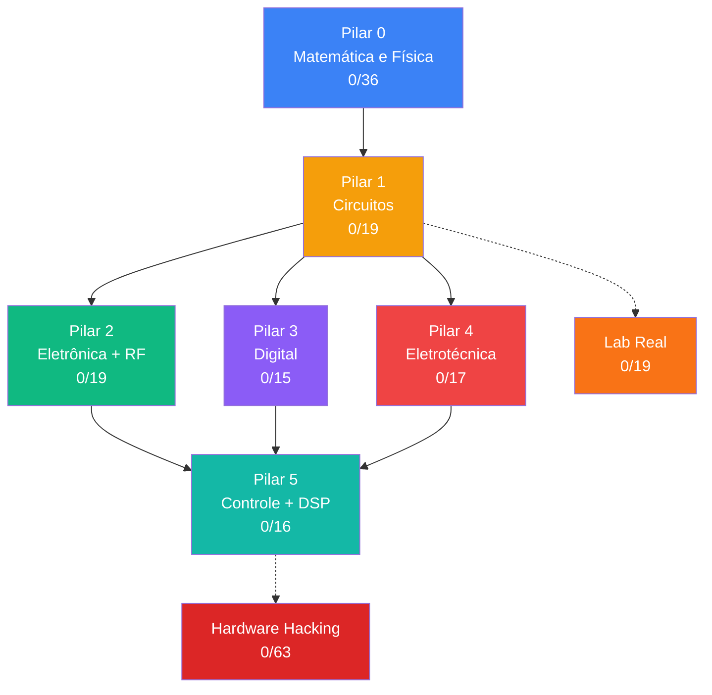

# Lucas Prestes Mendes

**Desenvolvedor Full Stack · Eng. Eletrônica @ UTFPR · Hardware Hacking**

---

Desenvolvedor full stack há 5 anos, com foco em e-commerce (Magento 2) e aplicações web (Laravel, Vue.js). Passei por freelance, empresa júnior, startups e uma das maiores agências de e-commerce do Brasil.

Hoje curso Engenharia Eletrônica na UTFPR (4º período) e estagio na EfiEnergy em Curitiba, onde trabalho com inversores de frequência, CLPs e eficiência energética industrial. Meu objetivo é juntar software, hardware e segurança — e eventualmente focar em hardware hacking.

Antes da UTFPR cursei Ciência da Computação na UFPR (2020-2021), onde peguei base em estruturas de dados e me envolvi com a empresa júnior.

---

## Experiência

**EfiEnergy** — Estagiário de Engenharia Elétrica `set/2025 – atual`
- Sistema interno de gerenciamento energético para clientes grupo A
- Programação de CLPs e inversores de frequência

**Bis2Bis E-commerce** — Dev Magento 2 Full Stack `set/2021 – jul/2025` (3a11m)
- Projeto Evolusom (maior da empresa) de ponta a ponta
- Módulo "Compre Junto" — um dos mais usados
- Frontend M1 → Backend M1 → Full Stack M2
- Mentorei 2 estagiários que viraram devs da equipe

**Upwork** — Dev Full Stack `mai – set/2021`
- Sistema de gestão de restaurantes: Laravel + Nuxt.js + CI/CD

**33Robotics** — Dev Full Stack `nov/2020 – mai/2021`
- Migração de ERP: PHP puro → API Laravel + Vue.js

**ECOMP (EJ - UFPR)** — DevOps + Frontend `mai – nov/2020`
- Deploy Heroku/Docker, pesquisa de segurança interna (OWASP), Scrum Master

---

## Formação

| Instituição | Curso | Período |
|-------------|-------|---------|
| **UTFPR** | Engenharia Eletrônica | 2024 – 2029 (previsto) |
| **UFPR** | Ciência da Computação | 2020 – 2021 |
| **CPM/PR** | Ensino Médio | 2012 – 2019 |

---

## Stack

| Área | Tecnologias |
|------|-------------|
| **Web** | PHP · Magento 2 · Laravel · JavaScript · Vue.js · Nuxt.js · Docker · Linux · MySQL · PostgreSQL |
| **Engenharia** | C · Python · Arduino · ESP32 · KiCad · LTspice · CLPs · Inversores |
| **Interesses** | Hardware Hacking · IoT Security · Engenharia Reversa · FPGA · Side-Channel |

---

## Projetos

**[Homelab Gatos](https://github.com/webtraveler-br/homelab-gatos)** — Plataforma de microsserviços pra monitorar a saúde e ambiente dos meus gatos. ESP32 + sensores + Flask + RabbitMQ + MQTT + dashboard Vue.js.

**[Jornada EE + Hardware Hacking](https://github.com/webtraveler-br/EE-and-hardware-hacking)** — Currículo autodidata: 7 pilares de EE + hardware hacking, 200+ módulos, ~500h. Progresso no [PROGRESS.md](https://github.com/webtraveler-br/EE-and-hardware-hacking/blob/main/PROGRESS.md).

---

## Progresso — Jornada EE & Hardware Hacking

> Detalhes: [EE-and-hardware-hacking/PROGRESS.md](https://github.com/webtraveler-br/EE-and-hardware-hacking/blob/main/PROGRESS.md)

---

Português nativo · Inglês fluente

